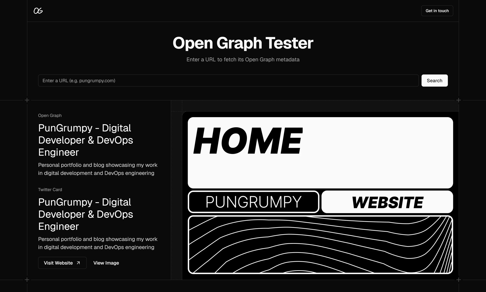

    <h1>🧪 OG Tester</h1>
    
A tool to help you debug and preview your meta, Twitter, and Open Graph tags

    

## ✨ Features

- 🔍 **URL Testing** - Enter any URL to fetch and analyze its meta tags
- 📱 **Multi-Platform Previews** - See how your links appear on:
  - Twitter/X
  - Slack
  - Facebook
  - LinkedIn
  - Discord
  - WhatsApp
- 📊 **Comprehensive Meta Tags Table** - View and inspect all meta tags organized by category:
  - **General Tags** - title, description, author, viewport, canonical URL, robots, keywords, theme colors
  - **Open Graph Tags** - og:title, og:description, og:image, og:url, og:type, og:site_name, og:locale, image dimensions
  - **Twitter Tags** - twitter:card, twitter:title, twitter:description, twitter:image, twitter:site, twitter:creator
  - **Icons Panel** - Display all favicons with sizes and types
- 🖼️ **Image Previews** - Visual preview of Open Graph and Twitter Card images

## 📝 License

Licensed under the [MIT License](LICENSE).
